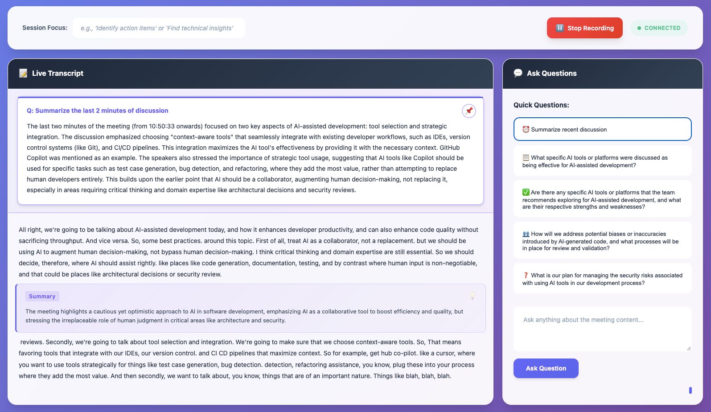

# Live Transcripts 🎤

**Real-time meeting transcription and AI-powered Q&A with modular backend support**

Live Transcripts captures system audio, transcribes it using state-of-the-art AI models, and enables intelligent conversations about your meetings—all in real-time. Now with flexible backend support: use cloud APIs (Gemini, OpenAI) or run entirely local on your GPU.



## 🌟 Current Features

| Feature | Description | Backend |
|---------|-------------|---------|
| **Real-time Transcription** | Instant, accurate speech-to-text | Google Gemini 2.0 |
| **Live Q&A** | Ask questions about ongoing discussions | Google Gemini 2.0 |
| **Smart Questions** | Context-aware suggestions every 15 seconds | Dynamic AI Analysis |
| **Auto Insights** | Meeting summaries and action items | Every 60 seconds |
| **Knowledge Base** | Integrate reference documents | Local file processing |
| **Session Focus** | Customize AI for specific meeting types | Intent-based |
| **Single API Key** | Simplified setup | GOOGLE_API_KEY only |

## 🚀 Quick Start

### Prerequisites

- **Python 3.9+** installed
- **Google AI API Key** ([Get one free](https://aistudio.google.com/app/apikey))
- **Audio capture** configured for your OS

### Installation

```bash
# Clone the repository
git clone https://github.com/aaronsb/cwmc.git
cd cwmc

# Set up virtual environment
python -m venv venv
source venv/bin/activate  # or `venv\Scripts\activate` on Windows

# Install dependencies
pip install -e ".[dev]"

# Configure audio (Linux users)
./scripts/configure-linux.sh

# Create .env file with your API key
echo "GOOGLE_API_KEY=your-key-here" > .env

# Run the application
python -m src.livetranscripts.main
```

Open http://localhost:8766 in your browser and click "Start Recording"!

## 🎯 Project Vision

Live Transcripts is evolving into a **modular, privacy-focused** meeting intelligence platform:

### Planned Features

- **🔌 Modular Backends:** Mix and match transcription and cognitive AI providers
  - Cloud: Gemini (✓), OpenAI (planned)
  - Local: Whisper-GPU + Qwen3/Llama (planned)

- **🖥️ Better UI:** Native desktop app (Qt) or TUI instead of web client-server
  - PySide6/Qt for native desktop integration
  - KDE Plasma widgets for Linux users
  - Terminal UI (TUI) for SSH/remote usage

- **📝 Session Logging:** All conversations and insights saved as searchable markdown
  - Git-friendly format
  - Full-text search across all sessions
  - Token usage and cost tracking
  - Export to PDF/HTML

- **🏠 Local-First Option:** GPU-accelerated inference for complete privacy
  - Zero API costs
  - No data leaves your machine
  - Works offline
  - Faster on modern GPUs

## 📚 Documentation

- **[Architecture](docs/ARCHITECTURE.md)** - System design and planned improvements
- **[Roadmap](docs/ROADMAP.md)** - Development phases and timeline
- **[Local Models Research](docs/LOCAL_MODELS_RESEARCH.md)** - GPU inference options
- **[Usage Guide](USAGE_GUIDE.md)** - Detailed usage instructions
- **[Changelog](CHANGELOG.md)** - Version history

## 🎵 Platform Setup

### Linux (PipeWire/PulseAudio)

```bash
# Configure audio backend
./scripts/configure-linux.sh

# List available devices
./scripts/list-audio-devices.sh

# Select specific device (optional)
./scripts/configure-audio-device.sh
```

### macOS (BlackHole)

```bash
# Install BlackHole for system audio capture
brew install blackhole-2ch

# Configure
./scripts/configure-macos.sh
```

### Windows (WASAPI)

```bash
# Run configuration
./scripts/configure-windows.sh
```

## 🔑 API Keys

Currently requires **Google AI API Key** for both transcription and Q&A:

1. Get your free key: https://aistudio.google.com/app/apikey
2. Add to `.env` file: `GOOGLE_API_KEY=your-key-here`

**Coming Soon:**
- OpenAI support (optional alternative)
- Local GPU inference (no API key needed)

## 🛠️ Development

### Running Tests

```bash
make test           # All tests
make test-unit      # Unit tests only
make test-coverage  # With coverage report
```

### Code Quality

```bash
make format         # Auto-format code
make lint           # Run linters
make type-check     # Type checking
make check          # All quality checks
```

### Contributing

We welcome contributions! See our development docs:

- [Architecture](docs/ARCHITECTURE.md) for system design
- [Roadmap](docs/ROADMAP.md) for planned features
- Backend abstraction coming in Phase 1 (easy contribution point!)

## 📊 Current Status

- ✅ **Working:** Gemini transcription + Q&A (single API key)
- ✅ **Working:** PipeWire audio on Linux
- ✅ **Working:** Real-time transcription and insights
- 🔄 **Next:** Backend abstraction layer (Phase 1)
- 🔄 **Next:** Session logging to markdown (Phase 2)
- 📅 **Future:** Local GPU backends (Phase 4-5)
- 📅 **Future:** Qt desktop UI (Phase 6)

## 🎉 Recent Changes

**v0.2.0 (January 2025):**
- ✨ Added Google Gemini transcription support
- ✨ Single API key setup (GOOGLE_API_KEY)
- ✨ Improved Linux audio support (PipeWire)
- 📚 Reorganized documentation
- 🗺️ Published development roadmap

**v0.1.0 (December 2024):**
- Initial release with GPT-4o transcription
- Gemini Q&A integration
- Web-based UI

## 📄 License

MIT License - see [LICENSE](LICENSE) for details

## 🙏 Acknowledgments

- Original project by [forayconsulting](https://github.com/forayconsulting/cwmc)
- Built with OpenAI GPT-4o, Google Gemini, and open-source tools
- Community contributions welcome!

## 📞 Support

- **Issues:** https://github.com/aaronsb/cwmc/issues
- **Discussions:** https://github.com/aaronsb/cwmc/discussions
- **Wiki:** https://github.com/aaronsb/cwmc/wiki

---

**Made with ❤️ for better meetings**